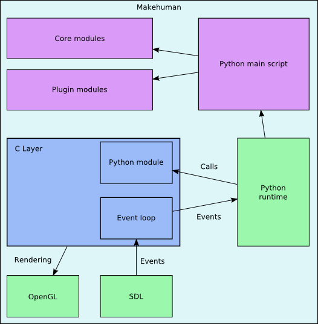

.. _application_overview:

.. highlight:: python
   :linenothreshold: 5

Application structure
======================

MakeHuman is constructed using two main application components:

* The python interpreter that includes an OpenGL based 3D engine and forms the intentionally small core of the application is written in C.
* The vast majority of the functional components, including the GUI and service functions are written in Python

Retaining this very small, highly optimised and stable C core avoids the need for pyopenGL and therefore avoids the need for Windows users to install the full Python package and to manually install a series of extra packages with associated dependencies and consequent installation issues.

Although the majority of the development effort is focused on Python code (which is an interpreted language so it doesn't require the application to be rebuilt for each code change), the C core does result in developers having to install the C development environment in order that they can perform a complete build.

The application is written in a layered fashion as detailed below.

   This figure illustrates the two main components of the MakeHuman Application along with the integration layer that connects them. The Python code delivers MakeHuman Specific functionality. The C application provides a Python interpreter and exposes a set of generic MakeHuman functions through the integration layer. 
   
   The integration layer consists of a set of C functions enabling events to be passed up to Python code and a dynamically generated Python module enabling C functions to be called from the Python code.

C code
=======

The C language is a compiled programming language, requiring developers to install a development environment in order to be able to build changes to the C source code into the application. The C layer is intended to be relatively stable and provides generic functionality to the Python code, minimising the need for C development.

The 3D graphics environment as a whole, including most of the 3D mesh handling functionality is delivered using OpenGL calls embedded within the C application code. User interaction and user events are handled using the SDL (Simple Direct Media Layer) library within the C application code. The SDL library manages low-level events (e.g. Mouse clicks, Mouse Movements, Keystrokes etc.) and makes those events available to the application event loop.

C data structure
-----------------

The principal data structures used by the C code are contained within the 'G.' global structure. This global data structure is defined in the file 'core.h' in the 'include' directory within SVN. Certain state information is held directly in 'G.', such as camera settings, viewport dimensions etc. Information required to define the 3D objects, such as the humanoid figure and the GUI controls is nested within the 'G.world.' data structure, which is a pointer to an array of object3D data structures. 

Each object3D data structure contains the information needed to define a single object to OpenGL (verts, norms, UV, colors etc.). 

Python code
============

Python is an interpreted language which means that you can add functionality into the Python layer without needing to recompile or rebuild the application.

The MakeHuman application incorporates a complete Python interpreter enabling you to add Python functionality to the a released version of the application without having to install any development software. To add Python functionality to the version of MakeHuman currently under development you do need a development environment to build the application from source code stored in SVN.

MakeHuman functionality is delivered through a combination of core Python modules and plugin Python modules assigned as function attributes on a Python Scene3D object that is instantiated by the main Python module (main.py) at application startup. The application is event driven using the SDL library in the C core to detect registered user events. 

These events are passed up to the Python functions that have been registered to handle those events on the Scene3D object. The Python event handling functions can interact with the C core through the generic MakeHuman functions exposed through the integration layer to perform the required functionality before returning control to the application event loop to await the next event reported by SDL.

Python Data Structures
-----------------------

The data used to populate the C data structures is maintained through Python code and a copy of that data is held in Python data structures. Python application components load the 3D object data required to populate the corresponding C data structures from object files. 

That data is loaded into instances of Python classes, that are defined in the file 'module3d.py' (in the 'mh_core' directory in SVN) before being transposed and copied down into the C data structures. 

These classes can be seen as being organised in a sort of hierarchical structure; A single Scene3D object holds references to the set of Object3D objects used to describe the humanoid model and the various GUI controls. 

Each Object3D object contains lists of references to the FaceGroup, Face and Vert objects that are used to construct a single 3D object. 

