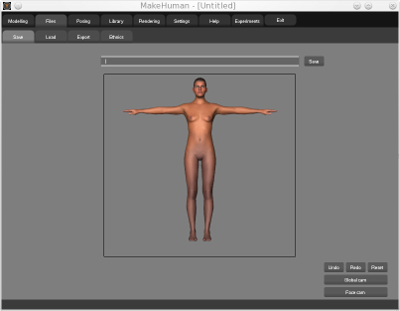

.. _posing:

.. highlight:: python
   :linenothreshold: 5

*********
Posing
*********

Expressions
==============

To make an expression on the model’s face, choose the expression category on the
right, then drag the slider from the desired expression on the left as much to the right
as needed.
To do.

Poses
=======

To do.
