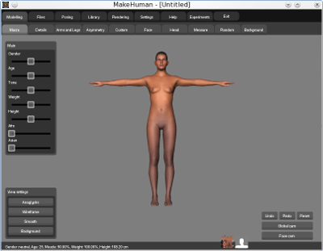

.. _theview:

*********
The view
*********

Default Display
=================

When you first launch the MakeHuman application you should see the default human figure facing you with outstretched arms.

As illustrated in the screenshot above, the figure should appear in the center of the window and a set of toolbar buttons should be displayed along the top of the window to enable you to change modes. 
Various other controls are displayed on the left hand side of the screen and there is a bottom tool bar where buttons specific to the current mode can be displayed.
This is the modeling-macro mode screen and enables you to control the anatomy of the figure. 
   

Main Toolbar (Changing Modes)
==============================

.. figure::  _static/main_toolbar.png

The main toolbar along the top of the MakeHuman window allows you to change mode. Each mode supports a particular category of function and provides controls and options specific to that function. 

* The Modeling button opens the modeling sub-toolbar (default, macro modifiers mode). 

* The Files button changes the toolbar to File mode to enable file interactions (see file Options). 

* The Posing button opens the Pose Feature mode: expressions and body position (not yet completed in alpha 7) 

* The Libraries button changes the toolbar to Libraries mode to load hairs, clothes, backgrounds, skins, multi-resolution meshes and more.

* The Render button changes the toolbar to Render mode to access external rendering applications. 

* The Help button opens the help tool, to read the manual, report a bug and more.

* The Experiments button opens a sub-toolbar with experimental, uncompleted or unstable features.

* The Exit button terminates the MakeHuman application. 

View options
==============

.. figure::  _static/view_toolbar.png
   :align: left

|
There are 4 view options which might help during modeling: anaglyphs, wireframe, smooth and Background.

|
|

Anaglyphs
-----------

Anaglyphs mode renders the view from two viewpoints in red and cyan. When viewing this using red-cyan 3d glasses you can see the model in real 3d. There are two anaglyphs modes which use a slightly different method to render both views, so it takes two presses of the button to turn it back off.

Wireframe
-----------

Wireframe mode is good to see the topology and how vertices and faces are changed by certain modifications. 

Smooth
----------

Smooth view might be too slow to work with on some systems. It subdivides the mesh with Catmull-Clark subdivision and keeps this subdivided mesh updated when modifying the model.

Background
------------

The background mode shows an image file on top of the model. This is useful when the model should resemble an existing sketch, photograph or render. The first time it is activated, it shows a list of files from the ~/makehuman/backgrounds folder to choose from. 

Afterward the background button toggles the background on and off. To choose another image go to library, background.

Common actions
===============

.. figure::  _static/view_common.png

Cameras
----------

There are two camera viewpoints between which can be quickly toggled, global camera and face camera.

Undo, redo and reset
----------------------

These are not view options, but they appear throughout the application. Undo and redo are quite straightforward; they undo the last modification or redo the last undone modification. Reset removes all modifications, be careful as it is impossible to undo this action. 

Navigation
========================

As you model and pose your human figure, you will need to turn, pan, and zoom in and out around you character.
These basic navigation functions can be performed using either hot keys on your keyboard, by using a mouse (a three buttoned mouse is recommended), or by using a graphics tablet.

The numeric keys, along with the '+', '-', '.', up, down, left and right keys on your keyboard are used as hot keys. The numeric key settings make most sense if you have a numeric pad on your keyboard. 

If you don't then you may still find it useful to use the ordinary numeric keys to perform operations that are not available using the mouse. 

In any case all keys are customizable in setting->shortcuts.

Mouse movement
---------------

The model can be freely moved and rotated using the mouse. Keep the left button pressed to rotate the model. Keep the right button pressed to translate the model. Zooming can be done by using the scroll wheel, or by keeping both the left and right button pressed. If the manipulation speed is too slow, hold shift to speed up movement.

Keyboard movement
------------------

The following keyboard navigation is the standard navigation. It can be customized in settings, shortcuts. Use the arrow keys to move the model around. Use the 2, 4, 6 and 8 keys to rotate the model. Use the '+' and '-' keys to zoom. There are 3 standard views which have shortcut keys. For the side view press 7, for the front view press 1 and for the top view press 3. The '.' key resets both position and zoom.

